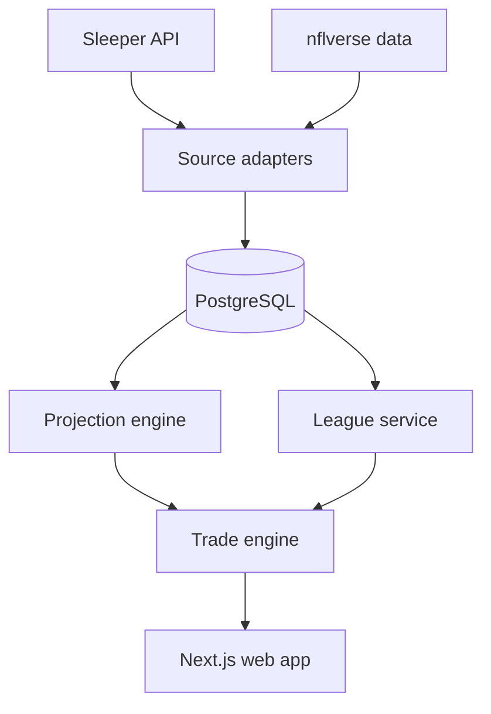

# Architecture

## Status

This is the initial target architecture. It should be updated when implementation decisions are proven in code.

## Planned stack

- Next.js with TypeScript
- PostgreSQL
- Prisma or Drizzle ORM (not yet selected)
- Tailwind CSS
- Sleeper API for league information
- nflverse for historical football data
- Vercel-compatible application hosting
- Managed PostgreSQL provider (not yet selected)

## System context



## Component responsibilities

### Web application

- Accept league and trade selections.
- Display loading, empty, unsupported, and failure states.
- Render structured trade-analysis results.
- Avoid implementing scoring or trade rules inside UI components.

### API/application layer

- Validate requests.
- Coordinate league import, projections, and trade analysis.
- Convert domain errors into stable API responses.
- Enforce caching and external-call limits.

### Source adapters

- Retrieve source-specific data.
- Validate responses at the boundary.
- Translate external objects into internal domain types.
- Preserve source identifiers without leaking source response shapes into the engine.

### Persistence layer

- Store players and external identifiers.
- Store raw weekly football statistics.
- Store versioned weekly projections.
- Store imported league configuration and roster snapshots.
- Make repeated imports idempotent.

### Scoring engine

- Convert raw statistics into fantasy points using league settings.
- Remain a pure, deterministic module.

### Projection engine

- Generate expected, low, and high weekly outcomes.
- Version every projection method.
- Support historical backtesting without future-data leakage.

### Lineup optimizer

- Find the highest-projected valid lineup under league roster constraints.
- Enforce eligibility and prevent duplicate player use.
- Report unfilled slots rather than silently ignoring them.

### Trade engine

- Copy original rosters in memory.
- Apply the proposed exchange without mutating stored rosters.
- Optimize before and after lineups for each analyzed week.
- Calculate lineup, depth, scarcity, risk, and fairness components.
- Return structured facts from which the UI derives its explanation.

## Primary request flow

1. The user imports a Sleeper league.
2. The Sleeper adapter validates and normalizes league settings, teams, and rosters.
3. The persistence layer upserts the normalized snapshot.
4. The user submits a proposed trade.
5. The application layer retrieves league rules, rosters, and projections.
6. The trade engine simulates the exchange and calls the lineup optimizer.
7. The engine returns a structured analysis.
8. The UI displays the verdict and its supporting calculations.

## Dependency rule

Dependencies point inward:

```text
UI and external adapters -> application services -> domain engines and types
```

Domain engines must not import React components, HTTP clients, ORM models, or source-specific response types.

## Reliability expectations

- Set timeouts for external calls.
- Retry only transient and idempotent operations.
- Cache source responses at an appropriate duration.
- Log imports, unmapped players, and analysis failures.
- Use transactions where a partial import would create misleading state.
- Preserve the last known valid data when a refresh fails.

## Security and privacy

- Do not collect Sleeper credentials; the documented API is read-only and unauthenticated.
- Keep database and deployment credentials in environment variables.
- Do not log secrets or unnecessarily retain personal user information.
- Validate all public input on the server.
- Rate-limit expensive import and analysis endpoints.

## Future extension points

- Additional platform adapters such as ESPN
- Dynasty pick valuation
- Waiver and trade recommendations
- Championship-probability simulation
- Optional model-generated explanations based only on computed structured results
