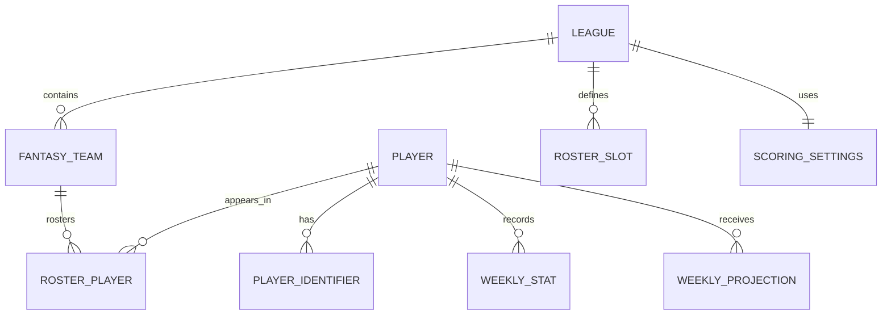

# Data Model

## Status

This is the conceptual model. Exact database types, indexes, and ORM syntax will be finalized during the database stage.

## Design principles

- Use internal IDs throughout domain logic.
- Store external identifiers separately.
- Store raw football statistics separately from calculated fantasy points.
- Version projections and analytical outputs.
- Preserve league-specific scoring and roster rules.
- Treat imported rosters as snapshots that can be refreshed.

## Entity relationships

## Core entities

### Player

- `id`: internal stable ID
- `full_name`
- `position`
- `nfl_team`
- `active_status`
- optional biographical disambiguators

### PlayerIdentifier

- `player_id`
- `source`
- `external_id`
- `verified_at`
- optional match method and confidence for reviewed imports

Constraint: `(source, external_id)` is unique.

### WeeklyStat

- `player_id`
- `season`
- `week`
- `season_type`
- raw passing fields
- raw rushing fields
- raw receiving fields
- fumbles and other supported scoring inputs
- opportunity fields such as attempts and targets
- source version and retrieval metadata

Constraint: one authoritative row per player, season, week, season type, and source/modeling grain.

### WeeklyProjection

- `player_id`
- `season`
- `week`
- `expected_points`
- `low_points`
- `high_points`
- `model_version`
- `generated_at`

Constraint: `(player_id, season, week, model_version)` is unique.

### League

- `id`
- `platform`
- `external_id`
- `name`
- `season`
- `team_count`
- import and refresh timestamps

Constraint: `(platform, external_id, season)` is unique.

### ScoringSettings

- `league_id`
- normalized supported scoring multipliers
- source configuration as validated JSON for traceability

### RosterSlot

- `league_id`
- `slot_type`
- `quantity`
- eligible positions

### FantasyTeam

- `id`
- `league_id`
- `external_id`
- `owner_external_id` when available
- `owner_display_name`
- `team_name`

Constraint: `(league_id, external_id)` is unique.

### RosterPlayer

- `fantasy_team_id`
- `player_id`
- `roster_status` such as starter, bench, injured reserve, or taxi
- source snapshot timestamp

Constraint: a player cannot appear on two teams in the same imported league snapshot.

### ImportRun

- `id`
- `source`
- `started_at` and `completed_at`
- `status`
- source version
- inserted, updated, rejected, and unmatched counts
- error summary

## Domain objects not necessarily persisted

### TradeProposal

- `team_a_id`
- `team_b_id`
- `team_a_sends`
- `team_b_sends`

### OptimizedLineup

- assignments from roster slots to players
- total projected points
- bench players
- unfilled slots

### TradeAnalysis

- original and simulated lineup totals
- weekly and rest-of-season changes
- starters entering and leaving
- depth and scarcity changes
- risk components
- raw fairness components
- verdict code
- algorithm versions

Persist trade analyses only if saved/shareable results become a confirmed feature.

## Invariants

- A player cannot fill more than one slot in a lineup.
- A simulated trade never mutates the imported roster snapshot.
- Every rostered source player must map to one internal player or appear in an unresolved report.
- Low projection must be less than or equal to expected, which must be less than or equal to high.
- Rest-of-season impact equals the sum of displayed weekly impacts.
- Every verdict must be reproducible from stored or returned components and algorithm versions.

## Open implementation decisions

- Prisma versus Drizzle
- UUID versus generated numeric internal IDs
- Whether league snapshots need explicit version tables
- JSON versus normalized columns for uncommon scoring rules
- Whether calculated league-specific fantasy points should be cached or always computed
